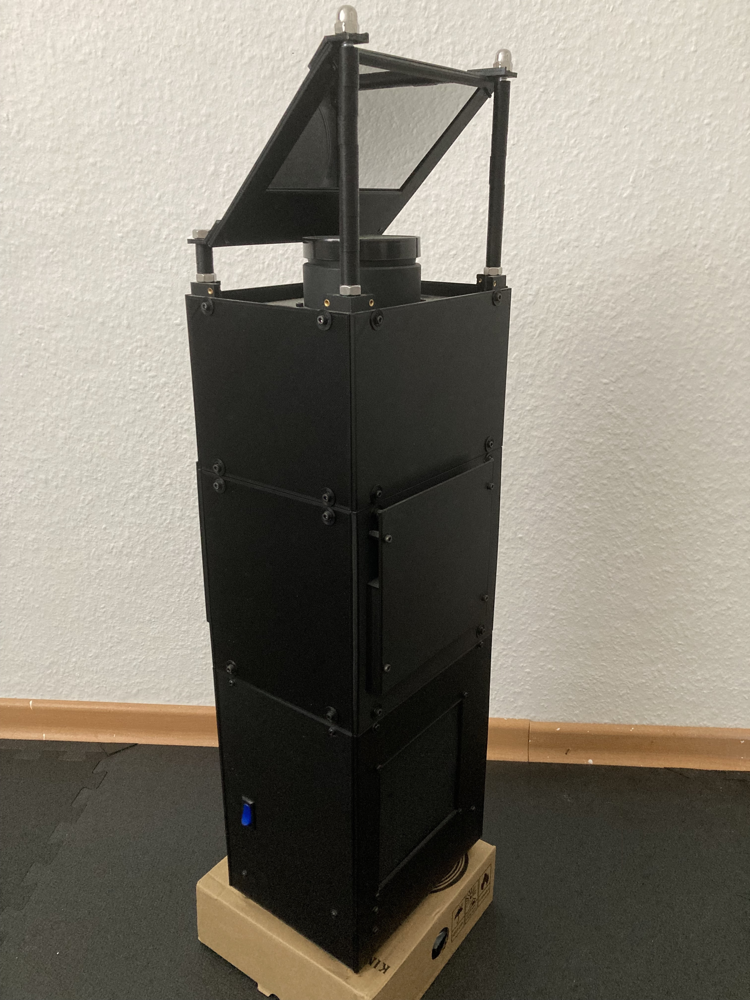
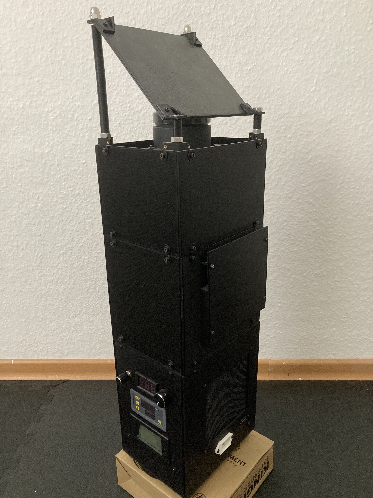
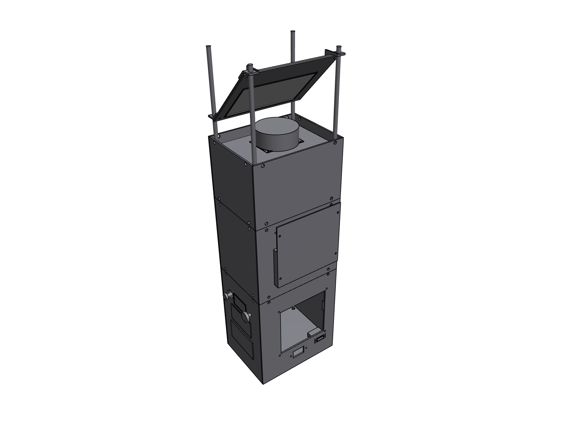
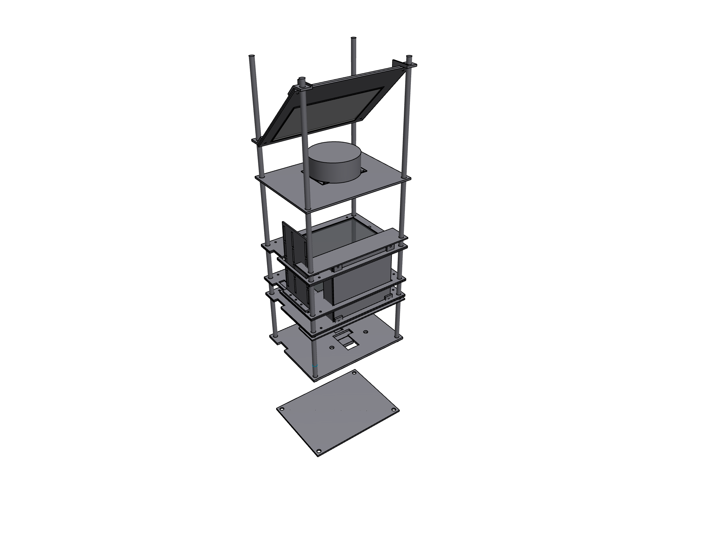
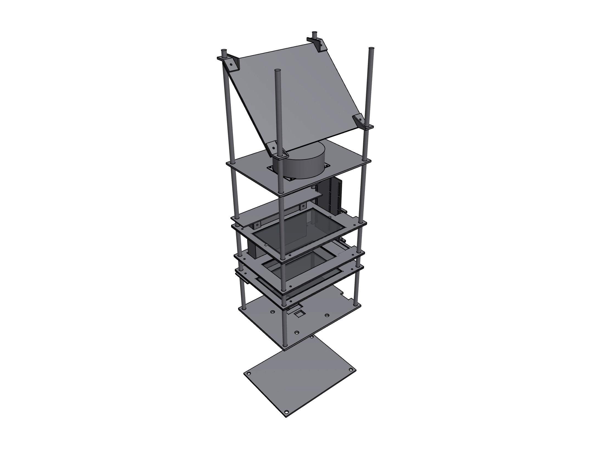
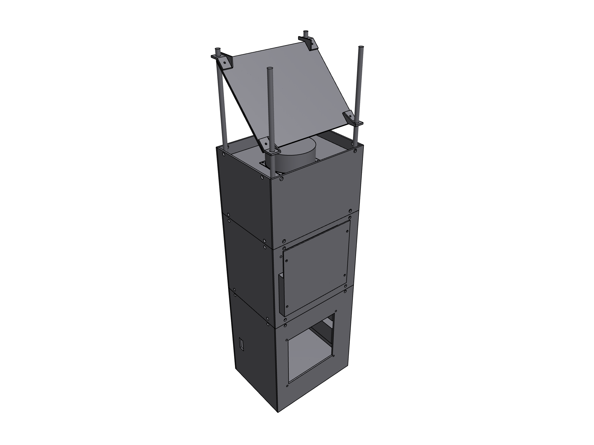

# 3D Printed Beamer
This repository acts as a showcase for the various things I build to get a suitable and working beamer.

## Table Of Content

- [Pictures](#pictures)
    - [Beamer](#beamer)
    - [3D files](#3d-files)
- [Parts List](#parts-list)
- [See also](#see-also)

## Pictures

### Beamer

    
    
    
    

### 3D files

    
    
    
    

## Parts List
- [LED Cooler: noctua nh-d9l](https://www.amazon.de/dp/B08995C4CR?psc=1&ref=ppx_yo2ov_dt_b_product_details)
- [LED PSU: 180w 36v](https://de.aliexpress.com/item/4000469060553.html?spm=a2g0o.order_detail.order_detail_item.15.67826368lXVsZH&gatewayAdapt=glo2deu)
- [LED driver/controller: 300w 40v-5v step down](https://de.aliexpress.com/item/32974477298.html?spm=a2g0o.order_detail.order_detail_item.17.67826368lXVsZH&gatewayAdapt=glo2deu)
- [Watt meter](https://de.aliexpress.com/item/33002069562.html?spm=a2g0o.order_detail.order_detail_item.19.67826368lXVsZH&gatewayAdapt=glo2deu)
- [Volatge meter](https://de.aliexpress.com/item/32969657184.html?spm=a2g0o.order_detail.order_detail_item.13.67826368lXVsZH&gatewayAdapt=glo2deu)
- [Fresnel-lense: 5,5 inch LCD 148mm * 82mm F185mm & 138mm * 100mm F 100mm](https://www.aliexpress.com/item/32890388868.html?spm=a2g0o.order_detail.order_detail_item.3.2a4e6368q5OW8A)
- [Fresnel-lense: 5,5 inch LCD 148mm * 90mm 185mm & 140mm * 90mm F 120mm](https://de.aliexpress.com/item/4000110873007.html?spm=a2g0o.order_detail.order_detail_item.9.2a4e6368q5OW8A&gatewayAdapt=glo2deu)
- [LCD objektiv](https://de.aliexpress.com/item/32651924613.html?spm=a2g0o.order_detail.order_detail_item.11.2a4e6368q5OW8A&gatewayAdapt=glo2deu)
- [LED objektiv](https://de.aliexpress.com/item/4000031520116.html?spm=a2g0o.order_detail.order_detail_item.13.2a4e6368q5OW8A&gatewayAdapt=glo2deu)
- [LCD 2k 5.5 inch](https://de.aliexpress.com/item/33022872686.html?spm=a2g0o.productlist.main.5.5ee83fZY3fZYdR&algo_pvid=57248d47-c0c6-486c-a906-4a7ce4d3d6ea&algo_exp_id=57248d47-c0c6-486c-a906-4a7ce4d3d6ea-2&pdp_npi=3%40dis%21EUR%2131.73%2122.21%21%21%2134.81%21%21%40214527fd16893453012213554d074a%2167181123111%21sea%21DE%21909277821&curPageLogUid=IyRqk8wRtROq)
- [LED 150w](https://de.aliexpress.com/item/4000270582422.html?spm=a2g0o.order_detail.order_detail_item.3.229e6368tsiTXl&gatewayAdapt=glo2deu)
- [Mirror/ reflector](https://de.aliexpress.com/item/32988030565.html?spm=a2g0o.order_detail.order_detail_item.3.27db6368U9c52a&gatewayAdapt=glo2deu)

## See also
You may also be interested in the following projects:
* [3040 CNC marlin](https://github.com/thob97/3040-CNC-marlin.git)
* [Custom 10 inch server rack](https://github.com/thob97/custom_10_inch_server_rack.git)
